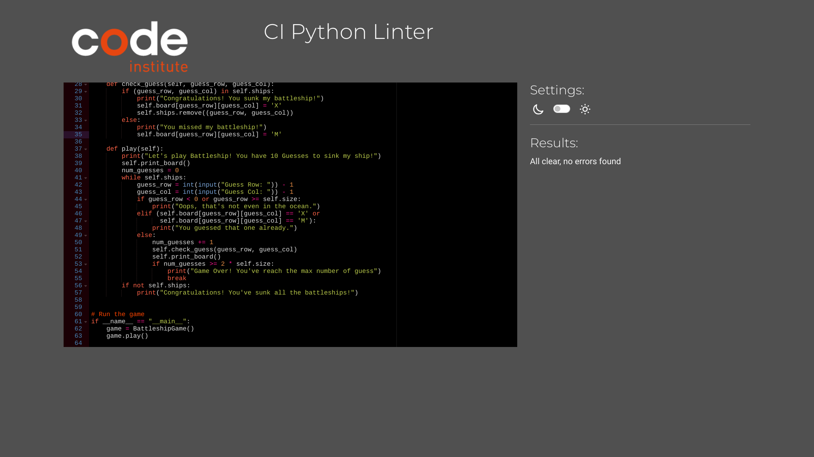

# Battleship Game

This is a simple implementation of the classic Battleship game in Python.
* This is the repository [https://github.com/beverworrior/Battle_ship.git]
* This is the link to my little game of wits [https://battleship92-b8f2d624a056.herokuapp.com]

## Users
This game is for the player to sink three ships before the guessing reaching maximum of 10 times.

## Getting Started 
To play the game, you can follow these steps:

1. Clone the repository or download the source code.
2. Make sure you have Python installed on your system.
3. Follow the on-screen instructions to play the game.

## Gameplay Instructions
1. Upon starting the game, you will see the game board represented as a grid of cells.
2. Enter the row and column coordinates to make a guess. You enter the number between 1-5 in row then same for 1-5 col.
3. If your guess hits a battleship, you'll be notified and the respective cell on the board will be marked as 'X'.
4. If your guess misses, you'll be notified and the respective cell on the board will be marked as 'M'.
5. Continue guessing until you sink all the battleships or reach the maximum number of guesses.
6. The game ends when you either sink all the battleships or exceed the maximum number of guesses.

## Future concept

I can customize the game by adjusting the parameters when creating an instance of the BattleshipGame class:
* Make the grid bigger and add more ships
* Make a input so the player can but there name before the start playing.
* Have a high score system like how fast the player could sink the ships.

## Code Structure

The code consists of the following components:

* BattleshipGame class: Implements the game logic, including board initialization, ship generation, and gameplay mechanics.
* Methods:
* __init__: Initializes the game with default or custom parameters.
* Generate_ships: Generates battleships at random locations on the board.
* print_board: Prints the current state of the game board.
* check_guess: Checks if the guess hits a battleship or not.
* play: Initiates the game loop and handles user input.

## Requirements 

* Python 3. 

## Testing

# How to deploy this to heroku
1. Step one create an account or login if you already have one.
2. Conected with you github repo with heroku.
3. Step two create a app and go to settings where you can name your app and choses bulidpacks Python and NodeJs in that order.
4. Push the deployed button and wait for all setting go trough from git then enjoy your deployed app.